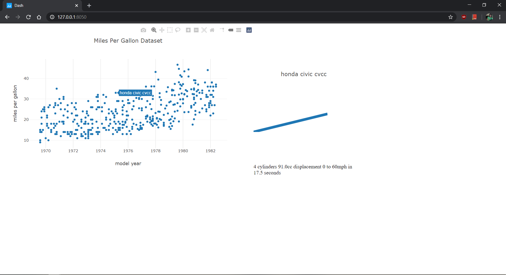

# Plotly_Dashboard_Mpg_Stock
 Plotly Dash Dashboard on Miles Per Gallon Dataset and Stock Data from Alpha Vantage

To run Dashboard on Miles Per Gallon Dataset:

```shell
python mpg_Dashboard.py
```


Add your API key from [Alpha Vantage](http://alphavantage.co/support/#api-key) on Stock Dashboard.py to Run it.

To run Dashboard on Stock Data:

```shell
python StockTicker_Dashboard.py
```

